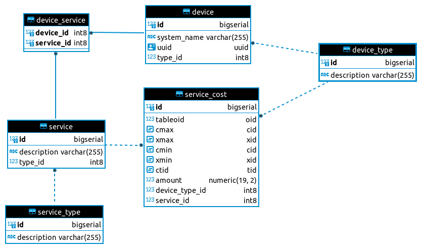

# Remote Monitoring and Management (RMM) platform
A Remote Monitoring and Management (RMM) platform helps IT professionals manage a fleet of Devices with Services associated with them. 

This REST API in Java with data persistence fulfills the most basic requirements of an RMM by keeping a simple inventory of Devices and Services to calculate their total costs.

## Tech Stack

* [JDK 17](https://www.oracle.com/java/technologies/javase/jdk17-archive-downloads.html)
* [Gradle](https://gradle.org)
* [Spring Boot](https://spring.io/projects/spring-boot)
* [PostgreSQL](https://www.postgresql.org)
* [Flyway](https://flywaydb.org)

## Build and tests

Use the gradle wrapper present in the project root.

```    
./gradlew clean build
```

## Dependencies

* [Docker Compose](https://docs.docker.com/compose/install)

Use the `docker-compose.yml` file present in the project root to start a PostgreSQL container. 

```    
docker compose up
```

## Starting the application

Run the `Application` class or use the gradle wrapper present in the project root.

```   
./gradlew bootRun
```

Go to:
* http://localhost:8080/swagger-ui/index.html

## Database

Url, username and password are present in `src/main/resources/application.yml` file.

```yml
url: jdbc:postgresql://localhost:5432/rmm_platform
username: user
password: password
```

Tables and some test data are created by [Flyway](https://flywaydb.org) during application startup.

Migration files are present in `src/main/resources/db/migration` folder.

## ER Diagram


